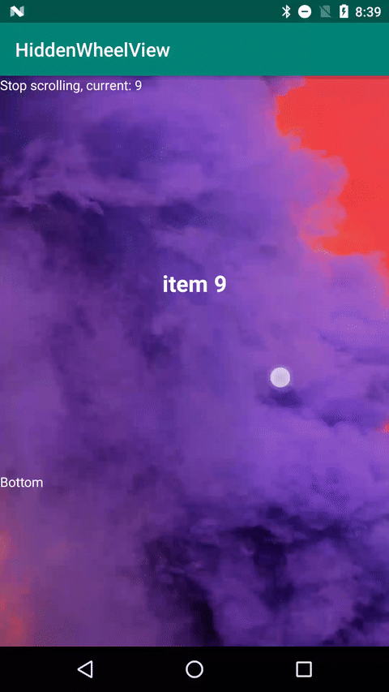

# HiddenWheelView

A custom Android wheel view that is shown as a wheel view only when scrolling. After the scroll stops, the wheel disappears and it becomes a normal view. 

## Features

- Appearance that changes with the user's actions
- Listener for the current position while scrolling
- Vibration feedback providing a comfortable UX
- Customizable showing/hiding animation duration

## Screenshot



## Usage

Add dependencies to your app's `build.gradle` :

```groovy
dependencies {
	implementation 'me.tictok:hiddenwheelview:2.0.0'
}
```

Put the view in your layout:

```xml
<me.tictok.library.HiddenWheelView
        android:id="@+id/wheelView"
        android:layout_width="match_parent"
        android:layout_height="wrap_content"
        app:allowVibrate="true"
        app:itemCount="5"
        app:itemHeight="60dp"
        app:animationDuration="450">
```

Customize an adapter class extending `RecyclerView.Adapter` and set it as the adapter of the view:

```Kotlin
val adapter = WheelAdapter(list, R.layout.wheel_item);
wheelView.setAdapter(adapter)
```

You can set an `OnSnapListener` if possible to listen to the snap while scrolling:

```Kotlin
wheelView.onSnapListener = object : HiddenWheelView.OnSnapListener {
            override fun onStopScrolling() {
                // TODO
            }

            override fun onSnap(position: Int) {
                // TODO
            }

        }
```

## Note

When the attribute `android:layout_height` is set to `wrap_content` , the height of the view will be set to the product of the values of the `itemHeight` and `itemCount` attributes; but when `android:layout_height` is set to `match_parent` or a specific dimension (e.g. `400dp` ), the `itemCount` and `itemHeight` attributes will be reduntant, that is, the view will display a suitable number of items.

## Changelog

- 2.0.1 (May 30, 2019)
  - Fix crash when two or more HiddenWheelViews appearing together restore their instance states
- 2.0.0 (May 09, 2019)
  - Rewrite all code with Kotlin
  - Add showing and hiding animation effects
  - Fix vibrating when the view is just displayed
- 1.0.1 (Dec 01, 2018)
  - Fix item list not filling the view when setting `android:layout_height` to `match_parent`
- 1.0.0 (Dec 01, 2018)
  - Initial release

## License

Copyright 2018 Hsiau-wei Mu

Licensed under the Apache License, Version 2.0 (the "License"); you may not use this file except in compliance with the License. You may obtain a copy of the License at

http://www.apache.org/licenses/LICENSE-2.0

Unless required by applicable law or agreed to in writing, software distributed under the License is distributed on an "AS IS" BASIS, WITHOUT WARRANTIES OR CONDITIONS OF ANY KIND, either express or implied. See the License for the specific language governing permissions and limitations under the License.
